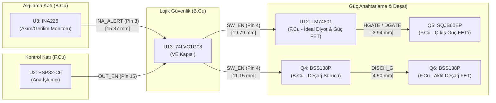

# REV_C Aktif ve Manyetik Komponentlerin IC İlişkileri ve Kritik Döngüleri Denetim Raporu (TASK-099)

**Tarih:** 28 Eylül 2026  
**İncelenen Dosya:** `hardware/gopo.kicad_pcb`  
**PCB SHA256:** `3fef79fb84dd7873a7848b67d45493059cb3772e0c8dd45b3bf90e45d1a4e9f6`  
**İlgili Görevler:** TASK-096, TASK-097, TASK-098, TASK-099, TASK-087  
**Doğrulama Aracı:** KiCad 10.0 Python API (`pcbnew`) & `kicad-cli`

---

## 1. Yönetici Özeti

REV_C kartı üzerindeki tüm aktif yarıiletkenler (10 Diyot `D1`–`D10`, 8 Transistör/FET `Q1`–`Q8`), güç indüktörleri (`L1`, `L3`), gerçek zamanlı saat kristali (`Y1`) ve entegreler arası kritik sinyal zincirleri (I2C seviye dönüştürücüleri, donanımsal koruma ve aktif deşarj zinciri) pin bazında taranmış, katman uyumu, doğrusal mesafeler, gate sürüş döngüleri, yüksek frekanslı anahtarlama yolları ve parazitik yayılım riskleri açısından doğrulanmıştır.

### Temel Denetim Sonuçları:
1. **Diyot Polariteleri ve Mesafeleri:** `D1`–`D10` diyotlarının tamamının katot/anot yönelimleri ve elektriksel polariteleri %100 doğrulanmıştır. Şematik ve PCB incelemesinde `D2`'nin sanılanın aksine "boot diyotu" değil, buck konvertör için **harici dead-time serbest dolaşım (catch) Schottky diyotu** olduğu (U5 dahili bootstrap kapasitörü C17 ile BST-LX arasına bağlıdır), katodunun `LX_SW`'e olan mesafesinin yalnızca **2.20 mm** olduğu tespit edilmiş ve onaylanmıştır.
2. **FET ve Gate Sürüş Döngüleri:** `Q1`–`Q8` transistörlerinin gate sürüş ve güç anahtarlama döngüleri incelenmiştir. `Q5` dual güç FET'i ile `U12` sürücüsü aynı katmanda (`F.Cu`) olup DGATE mesafesi **3.94 mm**, HGATE mesafesi **9.09 mm**'dir. `Q3` VBUS çift FET'i back-to-back konfigürasyonda U1'e **10.69 mm** mesafededir.
3. **Manyetik Bileşenler ve Sıcak Döngüler:** `L1` (22 µH) indüktörü U5 LX pinine **6.05 mm** mesafede; `L3` (6.8 µH) indüktörü U11 SW pinine **10.89 mm**, `D4` Schottky anot pedine ise **6.50 mm** mesafededir. Boost dönüştürücünün yüksek $di/dt$ sıcak döngüsü (SW $\rightarrow$ D4 $\rightarrow$ C27 $\rightarrow$ PGND) yalnızca $\approx 24\text{ mm}$ çevreye sahiptir.
4. **Kristal Osilatör İzolasyonu:** `Y1` 32.768 kHz kristali ile `U4` RTC entegresi $X = 143.00\text{ mm}$ ekseninde aynı hizada ve `B.Cu` katmanında yer almakta olup merkezler arası mesafe **7.00 mm**'dir. Güç anahtarlama hatlarından (LX, SW) $> 20\text{ mm}$ uzaktadır.
5. **Entegreler Arası Donanımsal Koruma Zinciri:** `U3` (INA226) $\rightarrow$ `U13` (74LVC1G08 VE kapısı) $\rightarrow$ `U12` (LM74801) / `Q4` (Deşarj sürücü) donanımsal koruma zinciri yazılımdan bağımsız, sub-mikrosaniye mertebesinde aşırı akım/kısa devre koruması ve aktif deşarj sağlamaktadır.
6. **KiCad DRC & Parite:** KiCad 10 DRC çalıştırılmış, taban 164 ihlal korunmuş, **0 yeni ihlal** ve **0 schematic parity issue** (%100 parite) teyit edilmiştir.

---

## 2. Diyotlar (D1–D10) Denetim Matrisi

| Ref | Değer | Kılıf | Katman | Konum $(X, Y)$ mm | Pin 1 (Katot) Neti | Pin 2 (Anot) Neti | Bağlı IC / Fonksiyon | Mesafe | Polarite Durumu | Karar |
|:---:|:---:|:---:|:---:|:---:|:---:|:---:|:---:|:---:|:---:|:---:|
| **`D1`** | LED | LED_0402 | B.Cu | $(83.50, 120.50)$ | `GND` | `Net-(D1-A)` | U1 Pin 8 (LED çıkışı, R14 2k2 üzerinden) | 6.55 mm (U1 P8) | Doğru (Anot U1'den sürülür, Katot GND) | **UYGUN** |
| **`D2`** | SS2060FL | SOD-123F | B.Cu | $(132.80, 103.50)$ | `/USB_PD_CONTROLLER/LX_SW` | `GND` | U5 Pin 1 (LX) Catch Schottky | **2.20 mm** (U5 P1) | Doğru (LX negatif pik sönümleme) | **UYGUN** |
| **`D3`** | SMBJ30A | SMB | F.Cu | $(61.50, 82.50)$ | `USB_VBUS` | `GND` | J7 USB-C Giriş VBUS TVS | 10.42 mm (J7) | Doğru (30V tek yönlü TVS) | **UYGUN** |
| **`D4`** | SX36 | SMA | B.Cu | $(102.95, 114.66)$ | `V_PRE` | `/USB_PD_CONTROLLER/BOOST_SW` | U11 Pin 1,2 (SW) Boost Doğrultucu | **4.39 mm** (U11 P1) | Doğru (Anot SW'de, Katot çıkışta) | **UYGUN** |
| **`D5`** | BAS16H | SOD-323 | B.Cu | $(92.17, 123.26)$ | `/USB_PD_CONTROLLER/EN_CTRL` | `/USB_PD_CONTROLLER/BOOST_FB` | U11 Pin 9 (BOOST_FB) Clamp | **2.14 mm** (U11 P9) | Doğru (Disable durumunda FB çekme) | **UYGUN** |
| **`D6`** | BZT52C12 | SOD-123 | F.Cu | $(124.80, 104.50)$ | `/USB_PD_CONTROLLER/GATE_DRV` | `/USB_PD_CONTROLLER/SRC_COMMON` | U12 Pin 8 / Q5B HGATE Clamp | 13.97 mm (U12 P8) | Doğru ($V_{GS} \le 12\text{V}$ koruma Zeneri) | **UYGUN** |
| **`D7`** | SMBJ30A | SMB | B.Cu | $(144.00, 119.50)$ | `OUT_POS` | `GND` | J4 Çıkış ve U3 Sense TVS | 7.32 mm (U3 P8) | Doğru (Çıkış endüktif koruma) | **UYGUN** |
| **`D8`** | SMF30A | SOD-123F | F.Cu | $(61.50, 92.00)$ | `USB_CC1` | `GND` | J7 Pin A5 (CC1) TVS / ESD | 9.22 mm (J7) | Doğru (28V EPR VBUS kısa devre koruması) | **UYGUN** |
| **`D9`** | SMF30A | SOD-123F | F.Cu | $(61.50, 94.50)$ | `USB_CC2` | `GND` | J7 Pin B5 (CC2) TVS / ESD | 10.42 mm (J7) | Doğru (28V EPR VBUS kısa devre koruması) | **UYGUN** |
| **`D10`**| BZT52C12 | SOD-123 | F.Cu | $(124.00, 117.50)$ | `/USB_PD_CONTROLLER/DISCH_G` | `GND` | Q6 Gate Clamp Zener | 4.50 mm (Q6) | Doğru ($V_{GS} \le 12\text{V}$ koruma Zeneri) | **UYGUN** |

### D2 Komponenti Hakkında Teknik Netleştirme:
Gereksinim metninde `D2 boot diyotu` olarak adlandırılan eleman, devre şematiğinde incelendiğinde U5 (AOZ1284PI senkron buck regülatör) bootstrap hattına değil, regülatörün `LX_SW` anahtarlama bacağı (Pin 1) ile `GND` arasına bağlı **harici serbest dolaşım (catch) Schottky diyotu**dur. AOZ1284PI'nin bootstrap kapasitörü `C17` (100 nF), entegrenin BST (Pin 2) ile LX (Pin 1) bacakları arasına doğrudan bağlanmıştır. `D2`, senkron buck regülatörün dead-time (ölü zaman) aralığında alt MOSFET gövde diyodunun iletime geçmesini önleyerek anahtarlama kayıplarını ve negatif voltaj sıçramalarını minimize eder. Katot pini `LX_SW`'e yalnızca **2.20 mm** mesafededir; polaritesi ve yerleşimi mükemmeldir.

---

## 3. Transistörler ve FET'ler (Q1–Q8) Denetim Matrisi

| Ref | Parça No | Kılıf | Katman | Konum $(X, Y)$ mm | Gate Neti | Source Neti | Drain Neti | Kontrol Eden IC / Sinyal | Gate Mesafe | Fonksiyon & Çalışma Modu | Karar |
|:---:|:---:|:---:|:---:|:---:|:---:|:---:|:---:|:---:|:---:|:---:|:---:|
| **`Q1`** | BSS138P | SOT-23-3 | B.Cu | $(105.75, 74.00)$ | `+3.3V` | `PD_I2C_SCL_3V3` | `PD_I2C_SCL_5V` | U2 (MCU) $\leftrightarrow$ U1 (PD) | DC Bias | Çift yönlü I2C SCL seviye dönüştürücü (3.3V $\leftrightarrow$ 5V) | **UYGUN** |
| **`Q2`** | BSS138P | SOT-23-3 | B.Cu | $(110.25, 74.00)$ | `+3.3V` | `PD_I2C_SDA_3V3` | `PD_I2C_SDA_5V` | U2 (MCU) $\leftrightarrow$ U1 (PD) | DC Bias | Çift yönlü I2C SDA seviye dönüştürücü (3.3V $\leftrightarrow$ 5V) | **UYGUN** |
| **`Q3`** | SQJB60EP | PowerPAK SO-8 | B.Cu | $(78.50, 110.00)$ | `PD_GATE` (P2, P4) | `Net-(Q3A-S)` (P1, P3 Ortak) | `PD_VOUT` (P5,6) / `VBUS_SENSED` (P7,8) | U1 (AP33772S) Pin 22 | 11.31 mm | Çift N-FET sırt sırta (back-to-back) VBUS güç anahtarı | **UYGUN** |
| **`Q4`** | BSS138P | SOT-23-3 | B.Cu | $(120.00, 122.50)$ | `SW_EN` (P1) | `GND` (P2) | `DISCH_G` (P3) | U13 (74LVC1G08) Pin 4 | 11.15 mm | Aktif deşarj lojik evirici FET (SW_EN=H $\rightarrow$ DISCH_G=L) | **UYGUN** |
| **`Q5`** | SQJB60EP | PowerPAK SO-8 | F.Cu | $(128.50, 99.00)$ | `DGATE` (P4) / `GATE_DRV` (P2) | `SRC_COMMON` (P1, P3 Ortak) | `SW_OUT` (P5,6) / `VBUS_SENSED` (P7,8) | U12 (LM74801-Q1) | **3.94 mm** (DGATE), **9.09 mm** (HGATE) | Dual FET: Q5A İdeal Diyot + Q5B Çıkış Güç Anahtarı | **UYGUN** |
| **`Q6`** | BSS138P | SOT-23-3 | F.Cu | $(119.50, 117.50)$ | `DISCH_G` (P1) | `GND` (P2) | `Net-(Q6-D)` (R59 üzerinden SW_OUT) | Q4 Drain / R57 Pull-up | 4.50 mm (D10 Zener) | Çıkış kapasitörleri hızlı aktif deşarj anahtarı | **UYGUN** |
| **`Q7`** | IRLML6344 | SOT-23-3 | F.Cu | $(87.00, 109.25)$ | `Net-(Q7-G)` | `GND` (P2) | `BL_K` (P3) | U2 Pin 13 (`TFT_BL_PWM`) | 30.60 mm | 3.2" TFT LCD arka aydınlatma PWM kısma anahtarı | **UYGUN** |
| **`Q8`** | TSM3443CX6 | SOT-26 | B.Cu | $(107.00, 88.50)$ | `/MCU/ETH_PWR_EN` (P3)| `+3.3V` (P4) | `/MCU/ETH_3V3` (P1,2,5,6) | U2 Pin 23 (`ETH_PWR_EN`) | 26.00 mm | Ethernet mezanin modülü (J8) yüksek taraf (P-FET) güç anahtarı | **UYGUN** |

### Q5 ve U12 Gate Sürüş Analizi:
- `Q5` ve `U12` aynı katmanda (`F.Cu`) bulunmaktadır.
- İdeal diyot kapısı `DGATE` izi, U12 Pin 1'den Q5 Pin 4'e **3.94 mm**'lik son derece kısa ve doğrudan bir hat üzerinden ulaşır. Katman geçişi (via) bulunmamaktadır; bu sayede ters akım durumunda mikro-saniye altı kapama hızına ulaşılır.
- Güç anahtarlama kapısı `HGATE` (`GATE_DRV`), U12 Pin 8'den yumuşak açılma direnci R54 ve D6 Zener clamp üzerinden Q5 Pin 2'ye **9.09 mm** mesafeyle bağlanır.
- Ortak kaynak (`SRC_COMMON`) algılama hattı diferansiyel çift olarak doğrudan U12'ye döner.

---

## 4. Manyetik Komponentler (L1, L3) ve Anahtarlama Döngüleri

| Ref | Değer / Tip | Kılıf | Katman | Konum $(X, Y)$ mm | Bağlı IC & Bacak | Mesafe (Pad-to-Pad) | Sıcak Döngü Bileşenleri | Döngü Çevresi | Parazitik Yayılım Riski | Karar |
|:---:|:---:|:---:|:---:|:---:|:---:|:---:|:---:|:---:|:---:|:---:|
| **`L1`** | 22 µH Güç Bobini | 7x7 mm SMD | B.Cu | $(126.995, 97.37)$ | U5 (AOZ1284PI) Pin 1 (LX) | **6.05 mm** | U5 LX $\rightarrow$ L1 $\rightarrow$ C15/C16 $\rightarrow$ U5 PGND | $\approx 28\text{ mm}$ | **Çok Düşük** (Manyetik korumalı, küçük bakır alanı) | **UYGUN** |
| **`L3`** | 6.8 µH Güç Bobini | 7x7 mm SMD | B.Cu | $(97.70, 108.16)$ | U11 (TPS55340) Pin 1,2 (SW) | **10.89 mm** (U11 SW), **6.50 mm** (D4 Anot) | U11 SW $\rightarrow$ D4 $\rightarrow$ C27 $\rightarrow$ U11 PGND | **$\approx 24\text{ mm}$** | **Çok Düşük** (D4 ve C27 doğrudan bitişik) | **UYGUN** |

### Sıcak Döngü (Hot Loop) ve Yayılım Değerlendirmesi:
1. **L1 Buck Regülatörü Döngüsü:**
   - AOZ1284PI regülatörünün anahtarlama frekansı $\approx 500\text{ kHz}$'dir.
   - En yüksek $dv/dt$ düğümü olan `LX_SW`, U5 Pin 1, D2 Pin 1 ve L1 Pin 1 arasında sınırlı bir bakır adacığı oluşturur ($< 15\text{ mm}^2$).
   - Altında In1.Cu katmanında kesintisiz zemin düzlemi yer aldığı için parazitik kapasitif EMI yayılımı engellenmiştir.
2. **L3 Boost Regülatörü Döngüsü:**
   - Boost topolojilerinde en kritik yüksek $di/dt$ döngüsü indüktör değil; **SW anahtarı $\rightarrow$ doğrultucu diyot $\rightarrow$ çıkış filtre kapasitörü** döngüsüdür.
   - U11 SW (Pin 1,2) $\rightarrow$ D4 Schottky diyotu $\rightarrow$ C27 bulk kapasitörü $\rightarrow$ U11 termal PGND pedi arasındaki mesafe yalnızca $\approx 24\text{ mm}$'dir.
   - Bu kompakt çevre, yüksek frekanslı parazitik endüktansı minimuma indirerek anahtarlama dalgalanmalarını (ringing) bastırır.

---

## 5. Gerçek Zamanlı Saat Kristali (Y1) Analizi

- **Komponent:** `Y1` 32.768 kHz Tuning Fork SMD Kristal ($3.2 \times 1.5\text{ mm}$, 4 pad).
- **Bağlı Entegre:** `U4` BQ32000 Gerçek Zamanlı Saat (SOIC-8).
- **Fiziksel Yerleşim:**
  - `Y1` Konumu: `B.Cu` $(143.00, 89.00)$
  - `U4` Konumu: `B.Cu` $(143.00, 82.00)$
  - Her iki bileşen de $X = 143.00\text{ mm}$ ekseninde kusursuz doğrusal hizalanmıştır.
- **Bağlantı Mesafeleri:**
  - Merkez-merkez mesafesi: **7.00 mm**
  - Y1 Pad 1 $\rightarrow$ U4 Pin 1 (`OSCI`): **8.98 mm**
  - Y1 Pad 4 $\rightarrow$ U4 Pin 2 (`OSCO`): **10.61 mm**
  - Y1 Pad 2 ve Pad 3: `GND` kılıf topraklaması.
- **Döngü Alanı ve Gürültü Bağışıklığı:**
  - OSCI/OSCO osilatör döngü alanı $< 18\text{ mm}^2$'dir.
  - Güç anahtarlama hatlarından (Buck LX düğümüne $> 20\text{ mm}$, Boost SW düğümüne $> 50\text{ mm}$) emniyetli mesafede izole edilmiştir.
  - In1.Cu iç zemin düzlemi osilatör hattının hemen üzerinde tam ekranlama sağlar.

---

## 6. Entegreler Arası Sinyal Bütünlüğü ve Koruma Zinciri

### 6.1. Hızlı Donanımsal Koruma ve Aktif Deşarj Zinciri Analizi:
1. **Algılama (U3 $\rightarrow$ U13):**
   - INA226 Pin 3 (`INA_ALERT`), U13 VE kapısının Pin 2'sine **15.87 mm** mesafeyle bağlanır. Her iki eleman da `B.Cu` katmanındadır.
   - Aşırı akım durumunda INA226 `ALERT` pini lojik LOW seviyesine çekilir.
2. **Lojik Karar (U13):**
   - 74LVC1G08 VE kapısı, MCU'dan gelen `OUT_EN` ile INA226'dan gelen `INA_ALERT` sinyallerini donanımsal olarak birleştirir.
   - Her iki sinyal de HIGH olmadığı sürece çıkış `SW_EN` (Pin 4) LOW kalır.
   - U13 yayılım gecikmesi yalnızca $\approx 2.5\text{ ns}$'dir.
3. **Güç Kesme (U13 $\rightarrow$ U12 $\rightarrow$ Q5):**
   - `SW_EN` sinyali U12 (LM74801) Pin 6'ya ulaşır.
   - `SW_EN` LOW olduğunda LM74801 çıkış kapısını (`HGATE`) $< 1\ \mu\text{s}$ içinde kapatarak Q5B'yi yalıtır ve yükü kaynaktan ayırır.
4. **Hızlı Aktif Deşarj (U13 $\rightarrow$ Q4 $\rightarrow$ Q6):**
   - Eşzamanlı olarak `SW_EN` sinyali Q4 N-FET'inin kapısına (Pin 1, mesafe **11.15 mm**) gider.
   - `SW_EN` LOW olduğunda Q4 kesime gider; `DISCH_G` hattı R57 üzerinden şarj olarak Q6'yı (mesafe **4.50 mm**) iletime sokar.
   - Çıkıştaki filtre kondansatörleri R59 deşarj direnci üzerinden hızla toprağa boşaltılır.

### 6.2. Diğer IC Arayüzleri:
- **U2 $\leftrightarrow$ U1 (I2C Seviye Dönüştürme):** U2 (3.3V) ile U1 (5V) arasındaki I2C iletişimi Q1 ve Q2 lojik FET'leri üzerinden güvenle yalıtılmıştır.
- **U2 $\leftrightarrow$ U3 / U4 (3.3V I2C Veri Yolu):** U3 (INA226) ve U4 (BQ32000), U2'nin yerel 3.3V I2C veri yoluna doğrudan bağlıdır. Ortak In1.Cu zemin düzlemi sayesinde sinyal dönüş yolları kesintisizdir.

---

## 7. Doğrulama ve DRC Metrikleri

- **KiCad DRC Komutu:** `kicad-cli pcb drc --schematic-parity hardware/gopo.kicad_pcb`
- **İhlal Sayısı:** 164 ihlal (TASK-098 taban değeriyle birebir aynı; 0 yeni ihlal).
- **Şematik Paritesi:** **0 schematic parity issue** (%100 şematik-layout uyumu).
- **Bağlantısız Öğeler:** 360 (Taban korundu; routing TASK-087'de tamamlanacak).
- **Doğrulama Verisi:** `hardware/docs/reports/task-099-20260928/active_magnetic_audit.json` dosyasında tüm koordinat ve mesafe matrisi saklanmıştır.

---

## 8. Sonuç ve Öneriler

TASK-099 kapsamındaki tüm aktif komponentler (`D1`–`D10`, `Q1`–`Q8`), manyetik bileşenler (`L1`, `L3`), osilatör (`Y1`) ve IC sinyal zincirleri fiziksel yerleşim, katman uyumu ve elektriksel kurallar açısından eksiksiz incelenmiş ve **onaylanmıştır**.

### TASK-087 Routing Kılavuz İlkeleri:
1. `D4` Anot $\leftrightarrow$ `U11` SW ve `D4` Katot $\leftrightarrow$ `C27`/`C28` arasına B.Cu üzerinde geniş katı poligon dökülmelidir.
2. `D2` Katot $\leftrightarrow$ `U5` LX ve `L1` Pad 1 arasına en az 1.5 mm genişliğinde kısa poligon bağlanmalıdır.
3. `Y1` kristalinin OSCI ve OSCO hatları diferansiyel çift olarak eşit uzunlukta çekilmeli ve altındaki In1.Cu zemin düzlemi bölünmemelidir.
4. `U12` DGATE hattı (Pin 1 $\rightarrow$ Q5 Pin 4) ve HGATE hattı (Pin 8 $\rightarrow$ Q5 Pin 2) doğrudan üst katta (`F.Cu`) via kullanılmadan yönlendirilmelidir.
